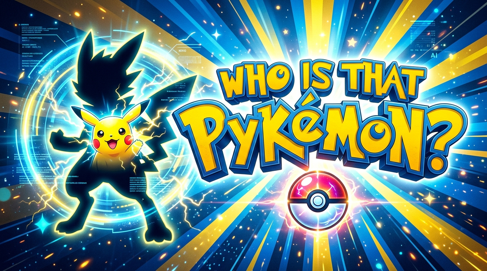

<p align="center">
  
</p>

<p align="center">
  
  
  
  
  
  
  
  
</p>

<h1 align="center">⚡️ WHO IS THAT PYKEMON? ⚡️</h1>

<p align="center">
  <strong>Transform your portrait photos into nostalgic, authentic <em>"Who's that Pokémon?"</em> reveal meme videos using AI background removal and video synthesis!</strong>
</p>

---

## 🏗️ Architecture & Project Structure

```text
who-is-that-pykemon/
├── backend/                  # Python 3 & FastAPI & MoviePy & rembg
│   ├── app/
│   │   ├── main.py           # REST API endpoints & background cleanup tasks
│   │   ├── config.py         # Global configuration & environment settings
│   │   ├── services/
│   │   │   ├── image_processor.py  # rembg background removal + pure black silhouette (#000000)
│   │   │   └── video_generator.py  # MoviePy 9:16 vertical video composition & audio mixing
│   │   └── utils/
│   │       └── assets_init.py      # Procedural fallback Pokémon background & chiptune synthesizer
│   ├── assets/               # Background images, sound effects, and custom fonts
│   ├── requirements.txt      # Python dependencies
│   └── tests/                # Pytest unit & integration test suite
│
├── frontend/                 # React 18 + Vite + TypeScript + Tailwind CSS + PWA
│   ├── src/
│   │   ├── App.tsx           # Photo upload/camera, name input, video player & Web Share
│   │   ├── index.css         # Tailwind & custom Pokémon styling
│   │   └── main.tsx          # Application entry point
│   ├── public/               # PWA icons (Pokéball SVG) & manifest
│   ├── vite.config.ts        # VitePWA configuration
│   └── package.json          # Frontend dependencies
│
├── docs/
│   └── images/               # README banner & visual assets
├── .github/workflows/        # Automated GitHub Actions CI pipeline
├── docker-compose.yml        # Multi-container orchestration
├── .gitignore                # Git ignore configuration
└── README.md                 # Project documentation
```

---

## ✨ Features

- **AI-Powered Background Removal:** Utilizes `rembg` (`u2net`) to isolate subjects while preserving hair and edge details.
- **Pure Black Silhouette Conversion:** Converts isolated RGBA images to pure `#000000` silhouettes while strictly maintaining the original alpha channel.
- **Synchronized Video & Audio Composition:**
  - **Stage 1 (0.0s – 3.5s):** Mysterious black silhouette with teaser sound.
  - **Stage 2 (3.5s – 7.0s):** Full-color reveal transition with custom Pokémon-styled *"IT'S [NAME]!"* badge and victory fanfare.
  - **Format:** 1080x1920 (9:16 vertical format) H.264 / AAC MP4 video optimized for mobile playback (TikTok, Instagram Reels, YouTube Shorts).
- **Progressive Web App (PWA):**
  - Installable on iOS, Android, macOS, and Windows ("Add to Home Screen").
  - Native Web Share API integration for direct video sharing to social media apps.
  - One-click video download.
- **Procedural Fallback Generator:** Automatically synthesizes standard Pokémon ray-burst backgrounds and 8-bit chiptune jingles if custom copyrighted assets are not provided.
- **Comprehensive Testing & CI:** Pytest test suite and GitHub Actions CI workflow for backend, frontend, and Docker validation.

---

## 🚀 Quickstart Guide

### Prerequisites
- Python 3.10+
- Node.js 18+ & npm
- FFmpeg installed on your system (`brew install ffmpeg` on macOS, or `apt install ffmpeg` on Ubuntu)

---

### 1. Docker Deployment (Recommended)

Run both backend and frontend in isolated containers with a single command:

```bash
# Build and start all services
docker compose up --build -d

# View real-time logs
docker compose logs -f

# Stop services
docker compose down
```

- **Frontend Application (PWA):** `http://localhost:3000`
- **Backend REST API:** `http://localhost:8000`
- **API Docs (Swagger UI):** `http://localhost:8000/docs`

---

### 2. Local Development Setup

#### Backend Setup:
```bash
cd backend

# Create and activate a virtual environment
python -m venv .venv
source .venv/bin/activate  # On Windows: .venv\Scripts\activate

# Install dependencies
pip install -r requirements.txt

# Run unit tests
pytest tests/ -v

# Start the FastAPI development server
uvicorn app.main:app --reload --port 8000
```

#### Frontend Setup (PWA):
```bash
cd frontend

# Install npm dependencies
npm install

# Start the Vite development server
npm run dev
```

- **Frontend Application:** `http://localhost:5173`

---

## 📡 API Reference

### `POST /generate-video`

Generates an MP4 reveal video from an uploaded portrait image and optional person name.

#### Request (`multipart/form-data`):
| Parameter | Type | Required | Description |
|-----------|------|----------|-------------|
| `file` | File (`image/*`) | Yes | Portrait image file (PNG, JPEG, WEBP) |
| `name` | string | No | Name to display during the reveal (Default: `Someone`) |

#### Response:
- **Content-Type:** `video/mp4`
- **Content-Disposition:** `attachment; filename="whos_that_[name].mp4"`

---

## 🧪 Running Tests

### Backend Unit Tests
```bash
cd backend
pytest tests/ -v
```

### Frontend Typecheck & Build Test
```bash
cd frontend
npm test
npm run build
```

---

## 🛠️ Environment Variables & Customization

| Variable | Description | Default |
|----------|-------------|---------|
| `VITE_API_URL` | Base URL of the FastAPI backend in Frontend | `http://localhost:8000` |
| `TEMP_DIR` | Directory for temporary video rendering | `/tmp/who_is_that_pykemon` |

### Customizing Assets:
You can replace the procedural assets by placing custom files into `backend/assets/`:
- `backend/assets/background.png`: Custom 1080x1920 transition background.
- `backend/assets/whos_that_pokemon.mp3`: Custom theme audio track.
- `backend/assets/fonts/Pokemon-Solid.ttf`: Custom font file.

---

## 📄 License

MIT License. Created for meme, educational, and entertainment purposes.
